# From Ore to Insight: A Flotation Plant, Six Months of Data — Python Analysis

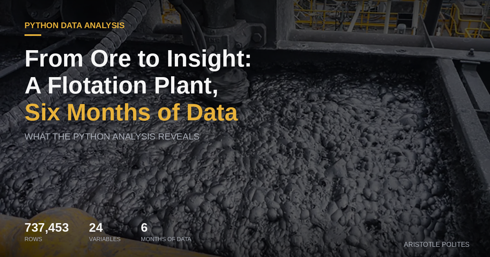

## Executive Summary

This project analyzes 737,453 rows of real industrial sensor data from a froth flotation plant used to separate iron ore from silica — recorded every 20 seconds across 24 variables over six months of continuous production (March–September 2017).

The analysis uses Python (Pandas, Seaborn, Matplotlib) to move from raw data to structured insight: converting data types, filtering to meaningful windows, reducing to relevant variables, and visualizing relationships between process inputs and output quality.

Three material findings emerged:

- Data loading and data understanding are two different steps — an unconverted datetime column quietly breaks all time-based filtering downstream, making type verification non-optional before analysis.
- Reducing 24 columns to 5 relevant variables is not simplification for its own sake — it is the core judgment call that makes applied analysis possible and focused.
- A single for loop automating four line-chart visualizations illustrates the compounding value of code: written once, it generates publication-quality charts on every subsequent run at no additional cost.

---

## Business Questions

- Which input variables (Starch Flow, Amina Flow, Ore Pulp pH, air flow rates) have the strongest relationship with output quality (% Iron Concentrate, % Silica Concentrate)?
- How do process variables behave across a single day of continuous operation — and what does that reveal about process stability?
- What does the correlation structure between variables look like — and which relationships are worth investigating further?
- At what threshold does Silica Concentrate become a problem, and which inputs push it there?

## Data Sources

| Dataset | Description |
|---|---|
| MiningProcess Flotation Plant Database | 737,453 rows × 24 columns of industrial sensor data from a froth flotation iron ore separation plant |
| Date Range | March 2017 – September 2017 (6 months of continuous production) |
| Sampling Frequency | Every 20 seconds |
| Key Outputs | % Iron Concentrate, % Silica Concentrate |
| Key Inputs | Starch Flow, Amina Flow, Ore Pulp pH, Ore Pulp Density, Flotation Column Air Flow and Level readings |

## Analysis

### 1. Getting the Tools in Place

Three libraries form the foundation: Pandas for data manipulation, Seaborn for visualization, and Matplotlib for rendering charts. The first check after loading the data was not a chart — it was types. Specifically, whether Python understood the date column as a date or as text. It was text.

That one line revealed something important: the data was loaded correctly, but not yet understood. A string that looks like a date and a datetime object that is a date behave completely differently when filtering or sorting by time. Converting it was a single line — pd.to_datetime() — but recognizing the conversion was necessary required attention to the data, not just the code.

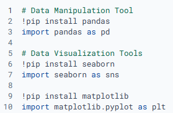
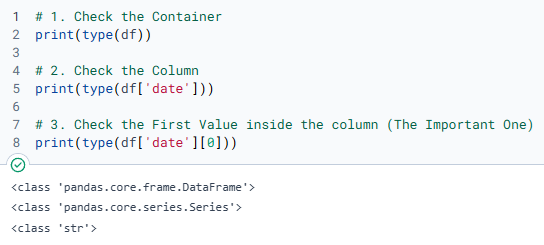
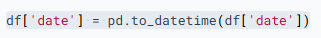
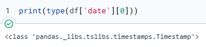

### 2. Exploring the Shape of the Data

Before filtering, .describe() provides the full statistical picture — counts, means, min/max, standard deviation — across every numeric column at once.

Several things stood out immediately. Starch Flow ranged from near zero to over 6,300, with a standard deviation exceeding 1,200 — an enormous range for a controlled industrial input. Silica Concentrate ranged from 1.31% to 33.4%. This step does not answer questions. It identifies which questions are worth asking.

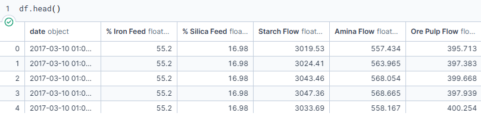
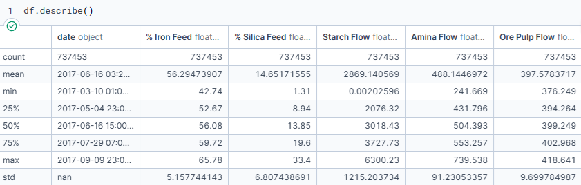

### 3. Filtering Down to One Day

With 737,000 rows, scope reduction is necessary before visualization is useful. Filtering to June 1st, 2017 using a date range filter in Pandas produces a workable window — one that only works correctly because the datetime conversion happened earlier. If the column had remained a string, the comparison would either fail silently or return incorrect rows.

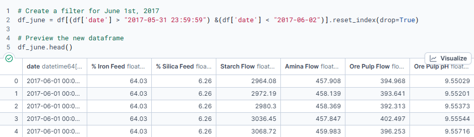

### 4. Selecting What Matters

Narrowing from 24 columns to 5 — Iron Concentrate, Silica Concentrate, Ore Pulp pH, and Flotation Column 05 Level — makes the dataset workable. The ability to identify and articulate which variables matter is most of what applied analysis actually is.

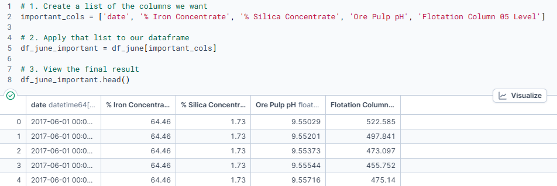

### 5. Visualizing Relationships

Three visualization types reveal different layers of the data:

- **Pairplot** — plots every variable against every other simultaneously, surfacing correlations, clusters, and outliers before committing to a specific chart
- **Correlation heatmap** — annotated with coefficients and colored by direction and strength, makes relationships between variables immediately readable
- **Line plots over time** — looped automatically across variables, illustrating that automation is not a feature but the point: four lines of code generate four publication-quality charts in sequence on every run
- 
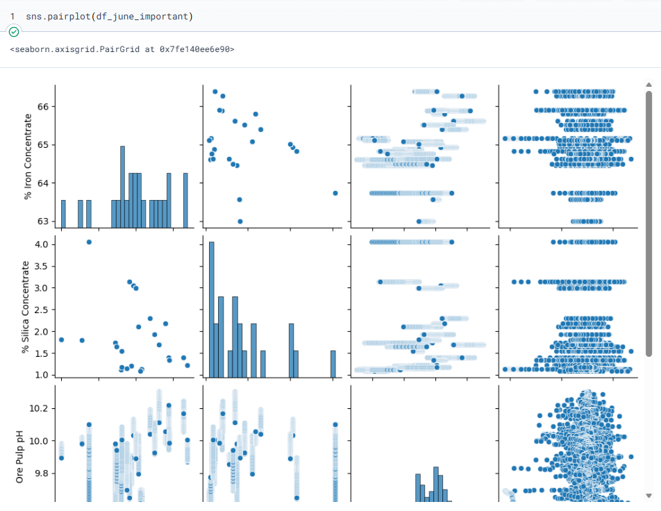
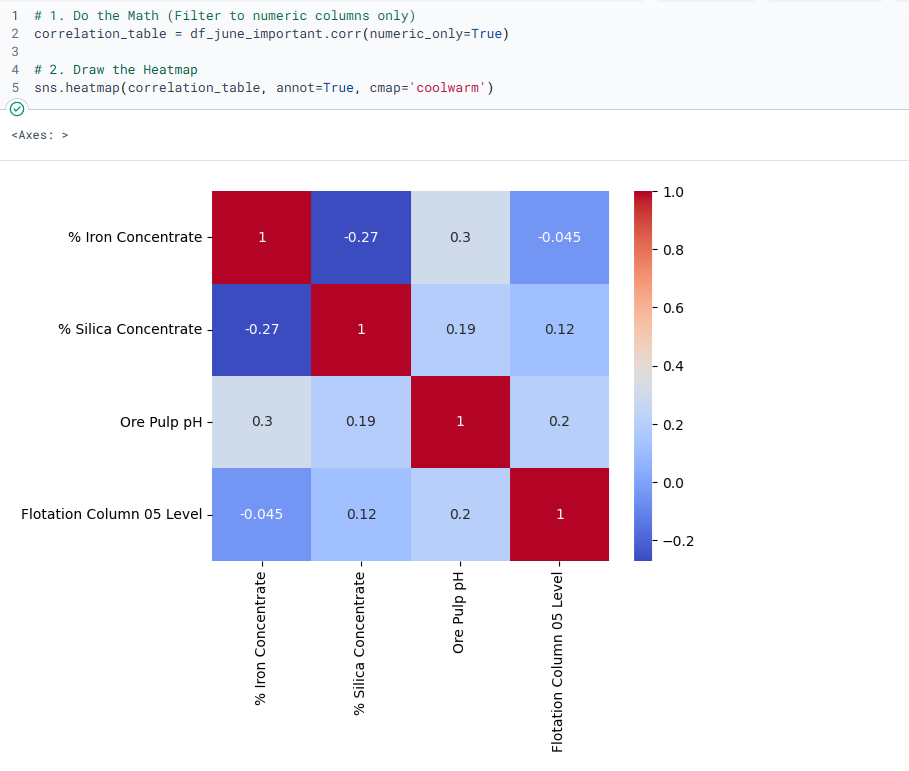
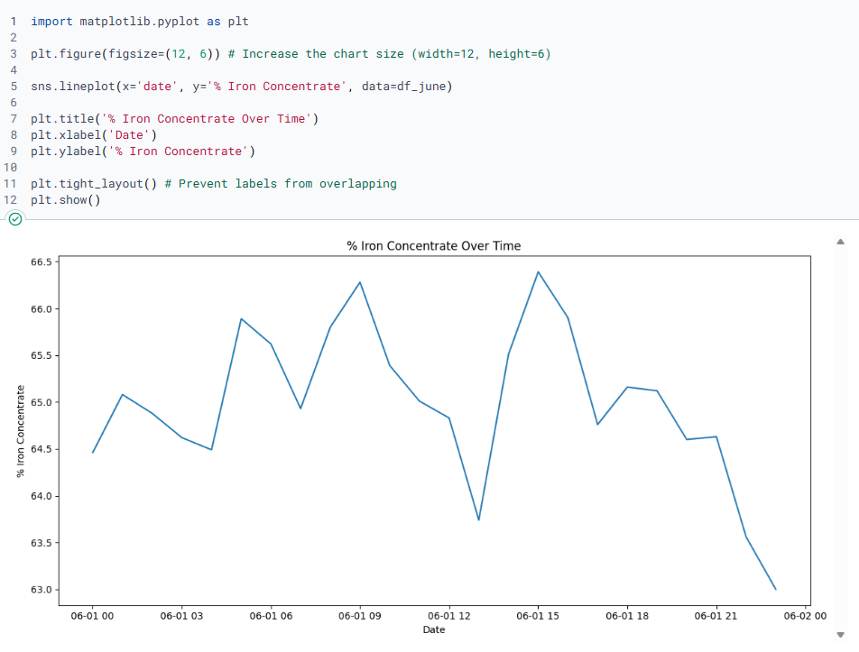

## Key Findings

| Finding | Implication |
|---|---|
| Type checking is non-optional | One unconverted column breaks everything downstream — verifying data types before analysis is what makes the rest of the work reliable |
| Reducing complexity is a skill | Going from 24 columns to 5 is not laziness — it is focus, and the best analysis uses the right data, not the most data |
| Loops change your relationship with repetition | Writing a for loop to automate four charts takes the same time as writing them manually, once — every run after is free |
| Visualization is a question, not an answer | The heatmap surfaced what was worth asking next — it did not conclude anything |
| Clean data compounds | Every earlier decision shapes what is possible later — the datetime conversion was not housekeeping, it was building the foundation |

## What's Next

The logical next step is predictive modeling — using input variables to forecast output quality before the process finishes. That moves the analysis from descriptive to actionable: not just understanding what happened, but anticipating what will.

Questions worth adding to a follow-on analysis:

- Which input variables have the strongest predictive relationship with % Iron Concentrate?
- How does process behavior differ across shifts, seasons, or operators?
- At what Silica Concentrate threshold does output quality become a problem — and which inputs drive it there?

## Tools

| Tool | Purpose |
|---|---|
| Python | Core analysis environment |
| Pandas | Data loading, type conversion, filtering, column selection |
| Seaborn | Pairplot and correlation heatmap generation |
| Matplotlib | Line chart rendering and loop-based automation |

---

*Dataset: MiningProcess Flotation Plant Database · Author: Aristotle Polites · Published: June 2026*
